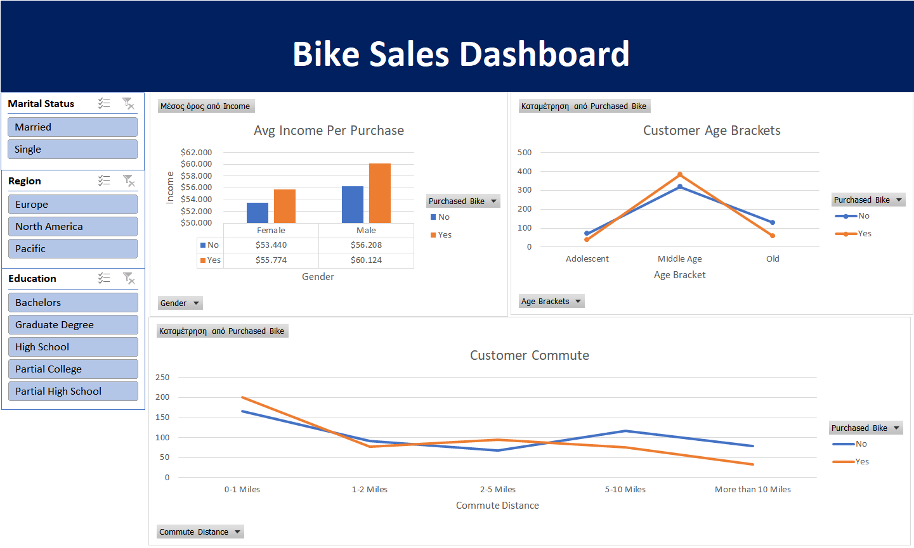

# 📊 Excel Bike Sales Dashboard

An interactive **Excel dashboard** built to analyze and visualize bike purchase data.  
Starting from raw data, I performed data cleaning, transformation, and created multiple pivot tables to uncover trends — all leading to a clean, insightful dashboard.

---

## Project Overview

This project showcases how to transform raw Excel data into a dynamic and visual dashboard that highlights key sales insights.

### Workflow
1. **Raw Data** – Imported the original dataset containing customer and sales details.  
2. **Data Cleaning** – Added new calculated columns, standardized names, and corrected inconsistencies.  
3. **Pivot Tables** – Built three pivot tables to summarize:
   - Bike purchases by gender, age group, and income
   - Average income per purchase
   - Customer distribution by region and education level  
4. **Dashboard** – Combined the pivot tables with slicers and charts to create an interactive dashboard.

---

## 🧮 Tools & Techniques Used

- **Microsoft Excel**
  - Data Cleaning and Transformation  
  - Calculated Columns and Formulas  
  - Pivot Tables & Slicers  
  - Charts and Conditional Formatting  

---

## 📈 Key Insights

- Middle-aged customers tend to have the highest bike purchase rate.  
- Higher income levels are strongly correlated with purchasing likelihood.  
- Education and region play notable roles in purchasing behavior.  

---

## 📊 Dashboard Preview

---

## How to Use

1. Download or clone this repository.  
2. Open `dashboard/bike_sales_dashboard.xlsx` in Excel.  
3. Use the slicers to interact with the dashboard — explore sales by region, education, and demographics.

---

## 🏁 Summary

This project demonstrates Excel’s power beyond simple spreadsheets — showcasing how raw data can be transformed into clear, interactive insights without coding.

